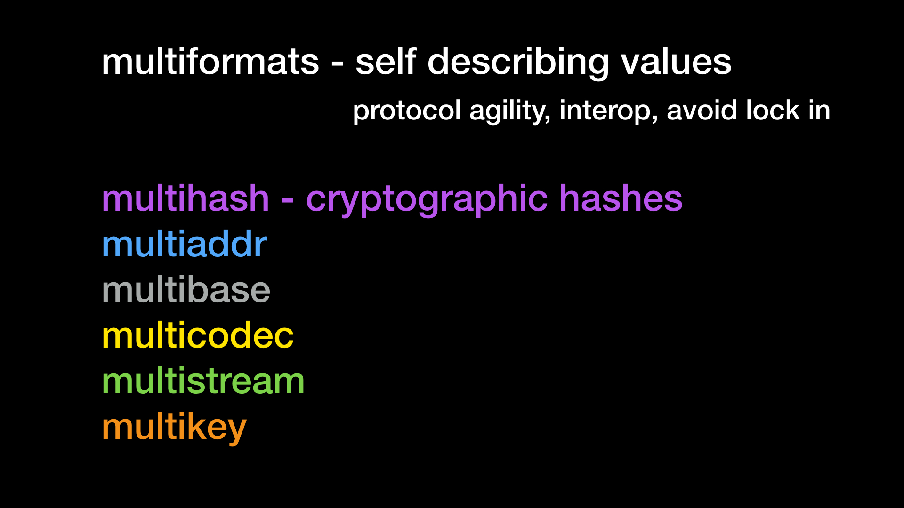
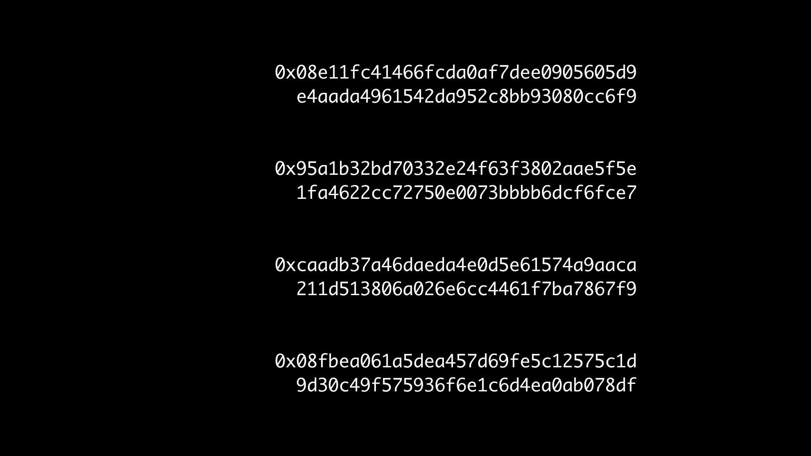
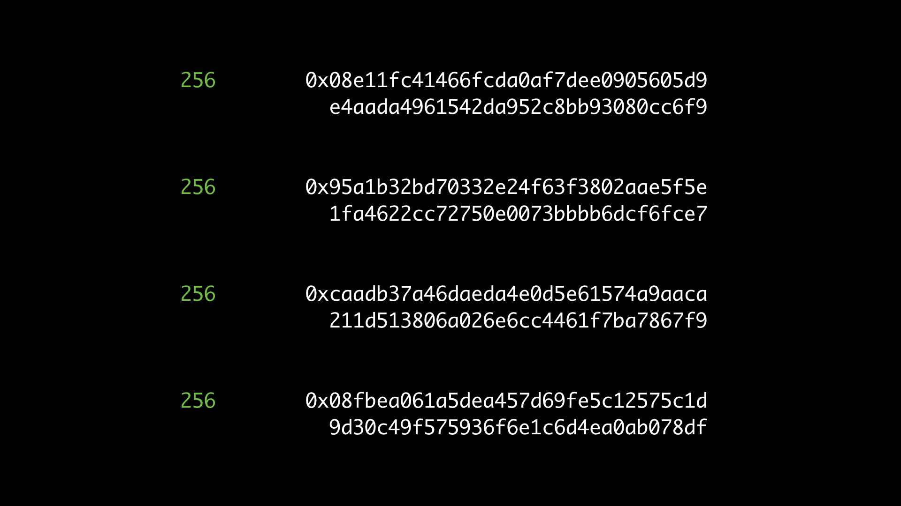
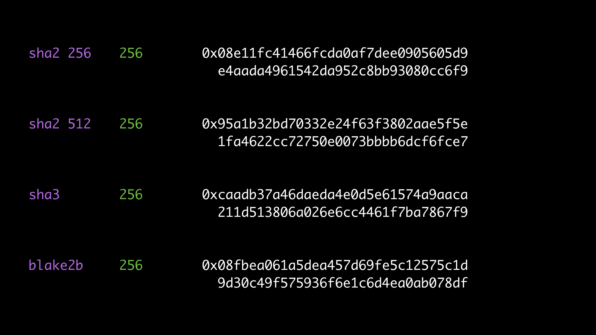
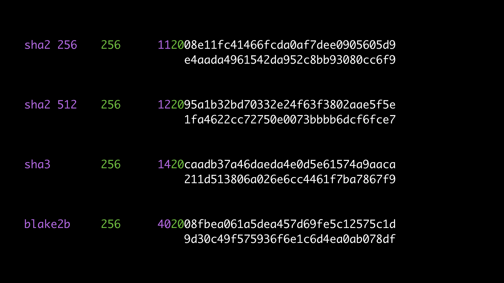
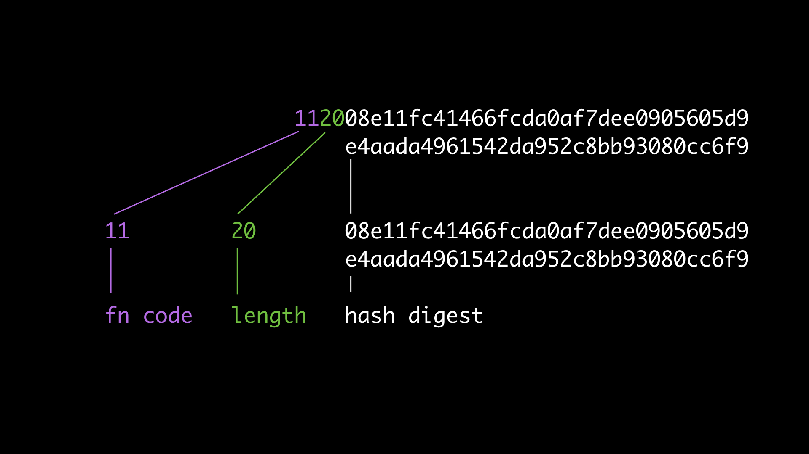
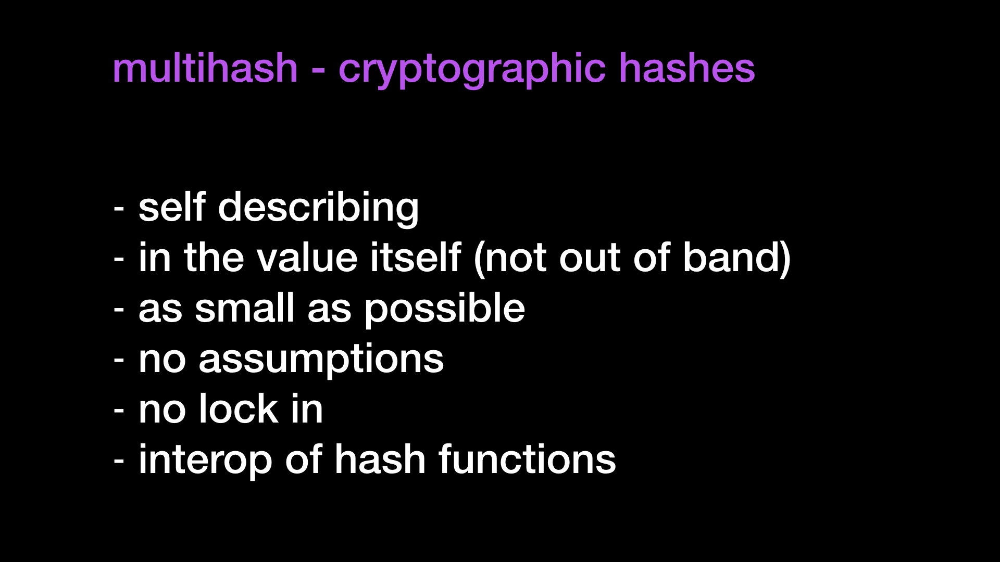
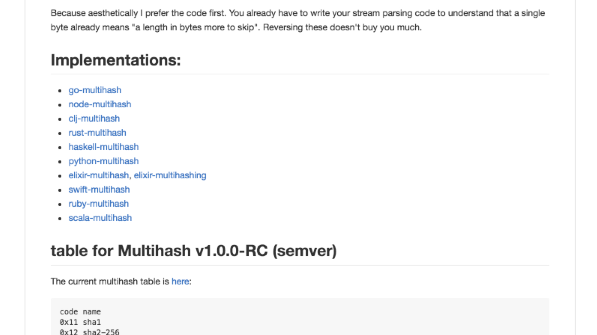
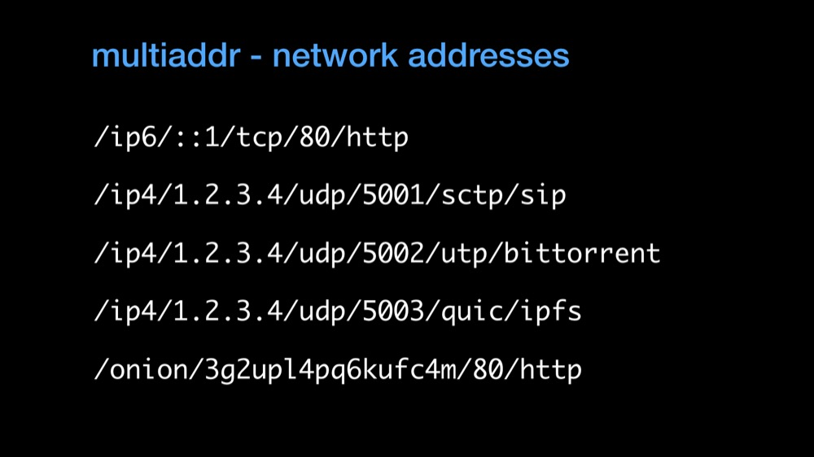

# multiformats

> The main repository for discussing multiformats.

> "Never going to change" considered harmful.
> -- @lgierth

This is the home repository for the multiformats effort, which produces these protocols:

- [multiaddr](//github.com/multiformats/multiaddr)
- [multicodec](//github.com/multiformats/multicodec)
- [multihash](//github.com/multiformats/multihash)
- [multistream](//github.com/multiformats/multistream)

### Works in Progress

These have not yet been fleshed out enough for their own repositories. See the links to contribute to conversations about them.

- multibase ([WIP](https://github.com/ipfs/specs/issues/130))
- multigram ([WIP](https://github.com/ipfs/specs/pull/123))
- multikey ([WIP](https://github.com/ipfs/specs/issues/58))

### Implementations

As well as specifications, we also have some implementations in this repository.

#### Go Implementations

- [go-multiaddr](https://github.com/multiformats/go-multiaddr)
- [go-multiaddr-net](https://github.com/multiformats/go-multiaddr-net)
- [go-multicodec](https://github.com/multiformats/go-multicodec)
- [go-multigram](https://github.com/multiformats/go-multigram)
- [go-multihash](https://github.com/multiformats/go-multihash)

#### JavaScript Implementations
- [js-multiaddr](https://github.com/multiformats/js-multiaddr)
- [js-multihash](https://github.com/multiformats/js-multihash)
- [js-multihashing](https://github.com/multiformats/js-multihashing)

#### C Implementations

- [c-multihash](https://github.com/multiformats/c-multihash) (_Only parsing and encoding, and not hashing._)

### Other Repositories

- [specs](https://github.com/multiformats/specs) - Specification work regarding multihash, multiaddr, and others. _WIP._
- [unsigned-varint](https://github.com/multiformats/unsigned-varint) - unsigned varint in use in multiformat specs. _WIP._

## Stub Explanation

While we write out a proper readme, here's some quick explanation slides:

---

### Example: Multihash

#### Consider these 4 different hashes of same input

#### Same length: 256 bits

#### Different hash functions

#### Idea: self-describe the values to distinguish

#### Multihash: fn code + length prefix

#### Multihash: a pretty good multiformat

#### Multihash: has a bunch of implementations already

---

### Example: Multiaddr

Basic example of multiaddr

