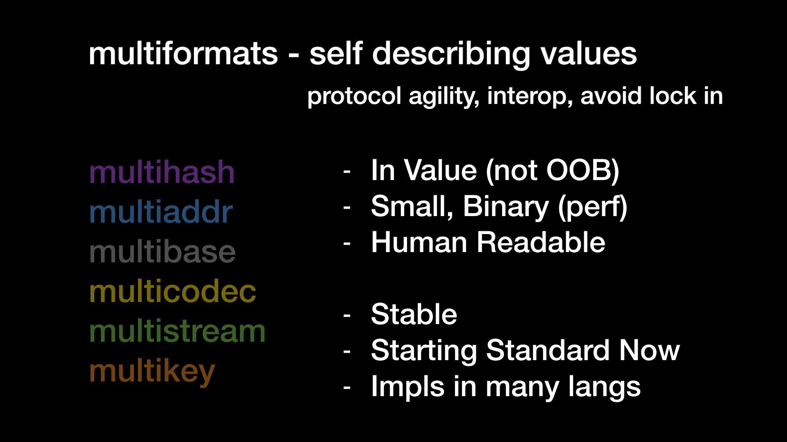

# multiformats

> The main repository for discussing multiformats

Multiformats is a set of self-describing protocol values. 
These values are foundational in that they are low-level building blocks for both data and network layers of the composable protocols making up IPFS, IPLD, libp2p, and many other decentralized data systems. 
This repository's issues and pull requests are currently the primary venue for the coordination between the various registries making up the group, each of which is separately being hardened as specifications and public, formal registries over time.  
See [contributing.md][./contributing.md] for more details on governance and process.

## Current Registries

Currently, we have the following formats, each of which corresponds to a specification and a registry. 
More formats are being discussed and may be added over time, but the following are the mature ones to date:

| Repo | Maintainer | Status | IETF |
|------|---------|--------|------|
| [multiaddr](https://github.com/multiformats/multiaddr)| @lgierth | stable | [WIP](https://github.com/multiformats/multiaddr/tree/doc/internet-draft) |
| [multibase](https://github.com/multiformats/multibase) | @jbenet | stable | [W3C CCG](https://github.com/w3c-ccg/multibase) |
| [multicodec](https://github.com/multiformats/multicodec)| @jbenet | stable | TBD |
| [multihash](https://github.com/multiformats/multihash)| @jbenet | stable | [W3C CCG](https://github.com/w3c-ccg/multihash) |
| [multikey](https://github.com/ipfs/specs/issues/58) | @protocol | WIP | TBD |

See the project directory, below, for implementations and other related repositories.

## Table of Contents

- [multiformats](#multiformats)
  - [Current Registries](#current-registries)
  - [Table of Contents](#table-of-contents)
  - [Background](#background)
    - [A note on the word Multiformats](#a-note-on-the-word-multiformats)
  - [Project Directory](#project-directory)
    - [Implementations](#implementations)
      - [Multiaddr Implementations](#multiaddr-implementations)
      - [Multihash Implementations](#multihash-implementations)
      - [Multicodec Implementations](#multicodec-implementations)
      - [Other Implementations](#other-implementations)
    - [Other Repositories](#other-repositories)
  - [Maintainers](#maintainers)
  - [Contribute](#contribute)
  - [License](#license)

## Background

Every choice in computing has a tradeoff. 
This includes formats, algorithms, encodings, and so on. 
And even with a great deal of planning, decisions may lead to breaking changes down the road, or to solutions which are no longer optimal. 
Allowing systems to evolve and grow is important.

Multiformats is a collection of protocols which aim to future-proof systems, today. 
They do this mainly by allowing data to be self-describable. 
This allows interoperability, protocol agility, and helps us avoid various forms of lock-in.
Currently, these interlocking protocols (both works in progress and implemented) cover the following areas:

- [multiaddr](https://github.com/multiformats/multiaddr): network addresses
- [multibase](https://github.com/multiformats/multibase): base encodings
- [multicodec](https://github.com/multiformats/multicodec): serialization codes
- [multihash](https://github.com/multiformats/multihash): cryptographic hashes
- [multikey](https://github.com/ipfs/specs/issues/58): cryptographic keys and artifacts

Several of the multiformats are stable, and work on the others is ongoing.
Implementers and refiners of the drafts of any one of these registries or their tooling are welcome to [contribute](./contributing.md), without needing to understand deeply or track progress on the others. 
Across these otherwise quite different use-cases and mechanisms, the self-describing aspects of the protocols have a few stipulations in common:

- the "prefixes" use to self-describe a value must be inline with the value (not passed out-of-band, in function calls, implicit choices, or documentation);
- they must be compact and have a binary-packed representation (as opposed to a sparser encoding) or they will hinder performance;
- they must have a human-readable representation.

### A note on the word Multiformats

`Multiformats` is the name for the community (and the "organization" in GitHub's access control model), but `multiformats` can also be used to refer to protocols; for instance, in the sentence "Use one of the multiformats". 
Formats is interchangeable with protocols, here, as each format is designed in tandem with one or more protocols which handle those self-describing values centrally. 
We try to capitalize Multiformats when it refers to the organization.

## Project Directory

Below, a list of all of the projects in the Multiformats organization is listed.

**Maintainers** are the active leads for each project, even if the specification is still under construction. 
Their responsibilities are to make sure that issues and pull requests are attended to in a timely manner, and general upkeep. 
If you have questions about a repository, or need feedback, please contact them as appropriate. 
If any of the specifications defining these formats are formalized and finalized in a standards body, these maintainers may continue on as Registrars of the table of entries which can keep growing after stabilizing the syntax and tooling interfaces.

### Implementations

As well as specifications, we also have some implementations checked into and maintained through the GitHub organization.
Checking in implementation code here is not a requirement of listing here, unless maintainership is being transferred.

#### Multiaddr Implementations

| Repo | Captain |
|------|-------------------|
| [cs-multiaddress](https://github.com/multiformats/cs-multiaddress) | @tabrath |
| [go-multiaddr](https://github.com/multiformats/go-multiaddr)| @whyrusleeping |
| [go-multiaddr-net](https://github.com/multiformats/go-multiaddr-net)| @whyrusleeping |
| [go-multiaddr-dns](https://github.com/multiformats/go-multiaddr-dns)| @lgierth |
| [java-multiaddr](https://github.com/multiformats/java-multiaddr)| @ianopolous |
| [js-multiaddr](https://github.com/multiformats/js-multiaddr)| @diasdavid |
| [rust-multiaddr](https://github.com/multiformats/rust-multiaddr)| @dignifiedquire |
| [SwiftMultiaddr](https://github.com/multiformats/SwiftMultiaddr)| @NeoTeo |
| [py-multiaddr](https://github.com/multiformats/py-multiaddr) |  |

#### Multihash Implementations

| Repo | Captain | Note |
|------|---------|------|
| [c-multihash](https://github.com/multiformats/c-multihash) | @Kubuxu | _Only parsing and encoding, and not hashing._ |
| [c-multihashing](https://github.com/multiformats/c-multihashing) | @Kubuxu | |
| [cs-multihash](https://github.com/multiformats/cs-multihash) | @tabrath | |
| [clj-multihash](https://github.com/multiformats/clj-multihash) | @greglook | |
| [ex_multihash](https://github.com/multiformats/ex_multihash)| @zabirauf | |
| [go-multihash](https://github.com/multiformats/go-multihash)| @Kubuxu | |
| [haskell-multihash](https://github.com/multiformats/haskell-multihash) | @LukeHoersten | |
| [java-multihash](https://github.com/multiformats/java-multihash) | @ianopolous | |
| [hash-overlay (Java 9)](https://github.com/comodal/hash-overlay) | @jamespedwards42 | |
| [js-multihash](https://github.com/multiformats/js-multihash)| @diasdavid | |
| [js-multihashing-async](https://github.com/multiformats/js-multihashing-async) | @dignifiedquire | |
| [js-multihashing](https://github.com/multiformats/js-multihashing)| @diasdavid | |
| [MultiHash.Net (fork)](https://github.com/multiformats/MultiHash.Net) | @MCGPPeters | |
| [php-multihash](https://github.com/multiformats/php-multihash)| @Fil | |
| [ruby-multihash](https://github.com/multiformats/ruby-multihash)| @kyledrake | |
| [rust-multihash](https://github.com/multiformats/rust-multihash)| @dignifiedquire | |
| [scala-multihash](https://github.com/multiformats/scala-multihash)| @parkan | |
| [SwiftMultihash](https://github.com/multiformats/SwiftMultihash)| @NeoTeo | |

#### Multicodec Implementations

| Repo | Captain | Note |
|------|---------|------|
| [clj-multicodec](https://github.com/multiformats/clj-multicodec) | @greglook | |
| [go-multicodec-packed](https://github.com/multiformats/go-multicodec-packed) | @whyrusleeping | |
| [go-multicodec](https://github.com/multiformats/go-multicodec)| @jbenet | |
| [js-multicodec](https://github.com/multiformats/js-multicodec) | @diasdavid | |

#### Other Implementations

| Repo | Captain | Note |
|------|---------|------|
| [cs-multibase](https://github.com/multiformats/cs-multibase) | @tabrath | |
| [go-multibase](https://github.com/multiformats/go-multibase) | @whyrusleeping | |
| [go-multigram](https://github.com/multiformats/go-multigram)| @lgierth | |
| [go-multistream](https://github.com/multiformats/go-multistream)| @whyrusleeping | |
| [java-multibase](https://github.com/multiformats/java-multibase) | @ianopolous | |
| [js-multibase](https://github.com/multiformats/js-multibase) | @diasdavid | |
| [js-multistream-select](https://github.com/multiformats/js-multistream-select) | @diasdavid | |

### Other Repositories

| Repo | Captain | Note |
|------|---------|------|
| [clj-varint](https://github.com/multiformats/clj-varint) | @ekroon | |
| [ma-pipe](https://github.com/multiformats/ma-pipe) | @jbenet | |
| [multiformats](https://github.com/multiformats/multiformats)| @RichardLitt | This repository |
| [specs](https://github.com/multiformats/specs)| @nicola | Specification work regarding multihash, multiaddr, and others. _WIP._ |
| [unsigned-varint](https://github.com/multiformats/unsigned-varint) | @jbenet | unsigned varint in use in multiformat specs. _WIP._ |
| [clj-varint](https://github.com/multiformats/clj-varint) | @ekroon | Simple wrapper around Bazel VarInt code.
| [website](https://github.com/multiformats/website) | @victorbjelkholm | The multiformats website |

## Maintainers

- [@daviddias](https://github.com/daviddias)

## Contribute

Check out our [contributing document](contributing.md) for more information on how we work, and about contributing in general.

## License

This repository is only for documents. 
All of these are licensed under the [CC-BY-SA 3.0](https://ipfs.io/ipfs/QmVreNvKsQmQZ83T86cWSjPu2vR3yZHGPm5jnxFuunEB9u) license © 2016 Protocol Labs Inc. Any code is under a [MIT](LICENSE) © 2016 Protocol Labs Inc.

[Code of Conduct]: https://github.com/ipfs/community/blob/master/code-of-conduct.md